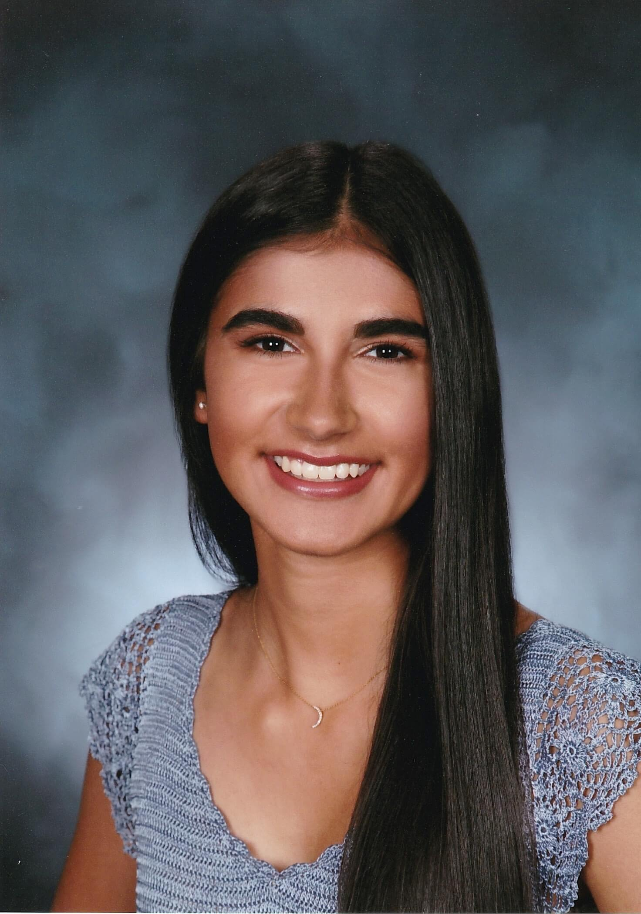

# Anisha Atwal

## As a Person
I am a class of 2023 student majoring in ***Computer Science*** and considering minoring in **Design**. I was born and raised in *Orange County, California*. In my free time, I love to cook pasta, go on hikes to beautiful views, and watch sunsets at the beach ~~or on mountains~~. My favorite quote that I strive to live by is:
> Everyone you meet is fighting a battle you know nothing about. **Be _kind_.** Always.

## As a Programmer

# Education
1. University of California, San Diego
2. Santa Margarita Catholic High School

# Experience
- Google Computer Science Summer Institute Participant
- UCSD Summer Program for Incoming Students Mentor
- SangamSD Tech Chair
- Sigma Kappa WebMaster
- UCSD CSE 15L Tutor
- UCSD Software Engineering Tools Team Member

# Projects (in progress & completed)
- [ ] [UCSD SPIS Website](http://spis.ucsd.edu/)
- [x] [HAPPY WebApp](http://ama-happy.appspot.com/)

# This Lab
For this Lab I used many git commands, including `git clone`, `git add`, `git commit`, and `git push`. I also created a [readme file](README.md) that has my favorite programming language as well as the link to this page. 